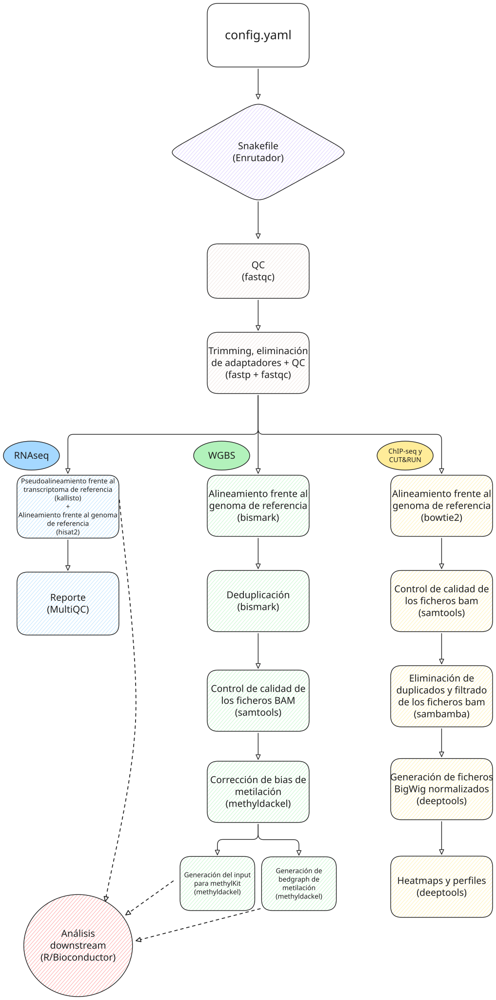

# CTA_TFM_UOC - Modular NGS Pipeline (Snakemake + Pixi)


Modular and reproducible NGS analysis pipeline built with Snakemake and Pixi. A single configuration file selects one of four supported workflows: RNA-seq, WGBS, ChIP-seq/CUT&RUN, or ATAC-seq.

### Main features
- Workflow selection from `config/config.yaml`.
- Reproducible software environment with Pixi and `pixi.lock`.
- Automatic sample discovery or manual sample declaration through `samples_info`.
- Shared QC and trimming with FastQC and `fastp`.
- Automatic reference indexing when required by the selected workflow.
- Unified reporting through MultiQC and structured per-step logs.

### Repository layout
- `Snakefile`: top-level entrypoint that dispatches to the selected subworkflow.
- `config/config.yaml`: central configuration file.
- `workflows/`: workflow modules.
- `workflows/rules/`: reusable rule files.
- `src/utils.py`: sample discovery and input handling helpers.
- `src/scripts/`: helper scripts used by specific workflows.
- `backlog.md`: tracked notable implementation and maintenance changes.

### Requirements
- Linux.
- [Pixi](https://pixi.sh/) installed.
- Enough disk space for FASTQ, BAM, and result files.
- Optional: Graphviz if you want to render DAGs with `dot`.

### Quick installation
```bash
git clone <repo-url>
cd Snakemake_pipeline_TFM
pixi install
```

### Basic configuration
The main configuration lives in `config/config.yaml`. At minimum you should:

1. Set the subworkflow in `pipeline`.
2. Define `raw_fastqs_dir` and/or `samples_info`.
3. Configure reference files and index directories required by the selected workflow.

#### Pipeline selection
```yaml
pipeline: "chip_cr"  # options: rnaseq, wgbs, chip_cr, atacseq
```

#### Manual sample input
```yaml
chip_cr:
  raw_fastqs_dir: "data/chip_fastqs"
  samples_info:
    sampleA:
      R1: "data/chip_fastqs/sampleA_R1.fastq.gz"
      R2: "data/chip_fastqs/sampleA_R2.fastq.gz"
      type: "PE"
```

#### Automatic sample discovery
If `samples_info` is omitted or empty, samples are discovered from `raw_fastqs_dir` using common naming patterns:
- Paired-end: `_R1/_R2`, `_1/_2`, `.R1/.R2`.
- Single-end: `<sample>.fastq.gz` or `<sample>.fq.gz`.

#### Workflow support notes
- `rnaseq`, `wgbs`, and `atacseq` currently support paired-end samples only.
- `chip_cr` supports both paired-end and single-end samples.
- Automatic ChIP/CUT&RUN bigWig subtraction expects names such as `liver_rep1` and `liver_input_rep1`.

### Running the pipeline
Dry run:
```bash
pixi run snakemake -n --cores 1
```

Standard execution:
```bash
pixi run snakemake --cores 8 --printshellcmds --latency-wait 60
```

Run until a specific rule:
```bash
pixi run snakemake --cores 16 --until chip_cr_fastqc_raw_pe
```

Run a single output target:
```bash
pixi run snakemake --cores 4 results/rnaseq/kallisto/sample/abundance.tsv
```

Re-run incomplete jobs:
```bash
pixi run snakemake --cores 8 --rerun-incomplete
```

Generate a DAG (requires Graphviz):
```bash
pixi run snakemake --dag --cores 1 | dot -Tpng > dag.png
```

### Step-by-step tutorials

#### 1) ChIP-seq/CUT&RUN (paired-end with input control)
1. Place paired-end FASTQ files in a directory such as `data/chip_fastqs/`.
2. Name the ChIP sample as `base_repX` and the matching input as `base_input_repX` to enable automatic bigWig subtraction.
3. Edit `config/config.yaml`:

```yaml
pipeline: "chip_cr"
chip_cr:
  raw_fastqs_dir: "data/chip_fastqs"
  samples_info:
    liver_rep1:
      R1: "data/chip_fastqs/liver_rep1_R1.fastq.gz"
      R2: "data/chip_fastqs/liver_rep1_R2.fastq.gz"
      type: "PE"
    liver_input_rep1:
      R1: "data/chip_fastqs/liver_input_rep1_R1.fastq.gz"
      R2: "data/chip_fastqs/liver_input_rep1_R2.fastq.gz"
      type: "PE"
  ref_genome: "ref/genome.fa"
  bowtie2_index_dir: "ref/bowtie2"
  gene_bed: "ref/genes.bed"
```

4. Run:
```bash
pixi run snakemake --cores 16 --printshellcmds --latency-wait 60
```

5. Key outputs:
- `results/chipseq_cutrun/multiqc_report.html`
- `results/chipseq_cutrun/bigwigs/*.bw`
- `results/chipseq_cutrun/subtracted_bigwigs/*.subtracted.bw`
- `results/chipseq_cutrun/deeptools/fingerprints.png`
- `results/chipseq_cutrun/deeptools/bam_correlation_heatmap.png` when 2 or more filtered BAMs are available
- `results/chipseq_cutrun/deeptools/heatmap.png`

#### 2) ChIP-seq/CUT&RUN (single-end)
For single-end data, define only `R1` and set `type: "SE"`:

```yaml
pipeline: "chip_cr"
chip_cr:
  raw_fastqs_dir: "data/chip_fastqs"
  samples_info:
    sampleSE:
      R1: "data/chip_fastqs/sampleSE.fastq.gz"
      type: "SE"
```

Outputs use the `_se` suffix, for example `sampleSE_se.sorted.bam` and `sampleSE_se.bw`.

#### 3) RNA-seq (paired-end)
1. Place paired-end FASTQ files in `data/rnaseq_raw_fastqs/`.
2. Configure `transcriptome_fasta`, `kallisto_index`, `ref_genome`, and `hisat2_index_dir`.
3. Example:

```yaml
pipeline: "rnaseq"
rnaseq:
  raw_fastqs_dir: "data/rnaseq_raw_fastqs"
  samples_info:
    Ctl_1:
      R1: "data/rnaseq_raw_fastqs/Ctl_1_R1.fq.gz"
      R2: "data/rnaseq_raw_fastqs/Ctl_1_R2.fq.gz"
  transcriptome_fasta: "ref/transcriptome.fa.gz"
  kallisto_index: "ref/kallisto.idx"
  ref_genome: "ref/genome.fa"
  hisat2_index_dir: "ref/hisat2"
  alignment_dir: "results/rnaseq/aligned_bams"
  marked_bam_dir: "results/rnaseq/marked_bams"
  duplication_qc_dir: "results/rnaseq/duplication_qc"
  deeptools_dir: "results/rnaseq/deeptools"
  bigwig_dir: "results/rnaseq/bigwigs"
  gene_body_coverage_dir: "results/rnaseq/gene_body_coverage"
  picard:
    java_opts: "-Xmx4g"
    markduplicates:
      extra_args: ""
  deeptools:
    multiBamSummary:
      extra_args: "--binSize 10000"
    plotCorrelation:
      extra_args: "-p heatmap --corMethod spearman --skipZeros"
    bamCoverage:
      normalize_using: "RPKM"
      extra_args: "--binSize 10"
  gene_body_coverage:
    enabled: true
    refgene_bed: "ref/duumy.bed"  # Dry-run placeholder only
    minimum_length: 100
    format: "pdf"
```

4. Run and review:
- `results/rnaseq/kallisto/<sample>/abundance.tsv`
- `results/rnaseq/aligned_bams/<sample>_pe.sorted.bam`
- `results/rnaseq/aligned_bams/<sample>_pe.hisat2.summary.txt`
- `results/rnaseq/marked_bams/<sample>_pe.markdup.bam`
- `results/rnaseq/duplication_qc/<sample>_pe.markdup.metrics.txt`
- `results/rnaseq/deeptools/bam_correlation_heatmap.png` when 2 or more aligned BAMs are available
- `results/rnaseq/gene_body_coverage/all_samples.geneBodyCoverage.txt`, `results/rnaseq/gene_body_coverage/all_samples.geneBodyCoverage.curves.pdf`, and `results/rnaseq/gene_body_coverage/all_samples.geneBodyCoverage.heatMap.pdf` when `rnaseq.gene_body_coverage.enabled: true` and 3 or more BAMs are analyzed
- `results/rnaseq/bigwigs/<sample>_pe.bw`
- `results/rnaseq/multiqc_report.html`

Duplicate marking is tracked in separate BAMs for QC and does not remove reads from the original RNA-seq alignment outputs.

HISAT2 also writes one summary file per sample next to the aligned BAM, which MultiQC uses for alignment statistics.

The RNA-seq correlation heatmap is generated from indexed aligned BAMs and is skipped automatically when fewer than 2 samples are available.

Use a real BED12 gene model matched to the RNA-seq genome assembly for production runs if you enable gene body coverage. `ref/duumy.bed` is only a placeholder for dry-run testing.

Set `rnaseq.gene_body_coverage.enabled: false` to skip this QC step entirely; when disabled, `gene_body_coverage.refgene_bed` is not required.

#### 4) WGBS (paired-end)
1. Place paired-end FASTQ files in `data/wgbs_raw_fastqs/`.
2. Configure `ref_genome`. Bismark will create `Bisulfite_Genome/` next to that reference.
3. Example:

```yaml
pipeline: "wgbs"
wgbs:
  raw_fastqs_dir: "data/wgbs_raw_fastqs"
  samples_info:
    Ctr_1:
      R1: "data/wgbs_raw_fastqs/Ctr_1_R1.fastq.gz"
      R2: "data/wgbs_raw_fastqs/Ctr_1_R2.fastq.gz"
  ref_genome: "ref/danrer11_lambda.fa"
  bismark:
    threads: 66
    parallel: 8
```

4. Key outputs:
- `results/wgbs/methyldackel/<sample>_CpG.methylKit`
- `results/wgbs/methyldackel_mergecontext/<sample>_CpG.bedGraph`
- `results/wgbs/multiqc_report.html`

5. Optional resource tuning:
- `wgbs.bismark.threads` and `wgbs.bismark.parallel`
- `wgbs.sambamba.filter_threads` and `wgbs.sambamba.sort_threads`
- `wgbs.methyldackel_mbias.threads` and `wgbs.methyldackel_extract.threads`

#### 5) ATAC-seq (paired-end)
1. Place paired-end FASTQ files in `data/atacseq_raw_fastqs/`.
2. Configure `ref_genome` and `bowtie2_index_dir`. Output directories default to `results/atacseq/*` unless you override them.
3. Example:

```yaml
pipeline: "atacseq"
atacseq:
  raw_fastqs_dir: "data/atacseq_raw_fastqs"
  samples_info:
    atac_rep1:
      R1: "data/atacseq_raw_fastqs/atac_rep1_R1.fastq.gz"
      R2: "data/atacseq_raw_fastqs/atac_rep1_R2.fastq.gz"
      type: "PE"
  ref_genome: "ref/Danio_rerio.GRCz11.dna.primary_assembly.fa.gz"
  bowtie2_index_dir: "ref/bowtie2_atacseq"
  peak_caller: "macs3"
  sambamba:
    view_extra_args: "not unmapped and proper_pair and mapping_quality >= 10 and not (ref_name =~ /^(MT|chrM)/)"
    filter_threads: 2
    sort_threads: 2
  deeptools:
    multiBamSummary:
      extra_args: "--binSize 10000"
    plotCorrelation:
      extra_args: "-p heatmap --corMethod spearman --skipZeros"
    plotFingerprint:
      extra_args: ""
  picard:
    java_opts: "-Xmx2g"
    markduplicates:
      extra_args: ""
  macs3:
    genome_size: "1.4e9"
    qvalue: 0.05
    extra_args: ""
  genrich:
    qvalue: 0.05
    min_auc: 20.0
    min_length: 0
    max_gap: 100
    extra_args: ""
```

4. Key outputs:
- `results/atacseq/duplication_qc/<sample>_pe.markdup.metrics.txt`
- `results/atacseq/deeptools/fingerprints.png`
- `results/atacseq/deeptools/bam_correlation_heatmap.png` when 2 or more filtered BAMs are available
- `results/atacseq/peaks/<sample>_peaks.narrowPeak`
- `results/atacseq/peaks/<sample>_summits.bed`, `results/atacseq/peaks/<sample>_treat_pileup.bdg`, and `results/atacseq/peaks/<sample>_peaks.xls` when `peak_caller: "macs3"`
- `results/atacseq/bigwigs/<sample>_pe.bw`
- `results/atacseq/fragment_qc/<sample>_pe.insert_size_metrics.txt`
- `results/atacseq/multiqc_report.html`

Duplicate reads are first marked with Picard to collect metrics, then removed during BAM filtering before deepTools QC, fragment QC, bigWig generation, and peak calling. The Picard-marked BAMs in `results/atacseq/marked_bams` are temporary intermediates; the retained duplicate artifact is the metrics file in `results/atacseq/duplication_qc`.

The ATAC-seq correlation heatmap is skipped automatically when fewer than 2 filtered BAMs are available. Set `peak_caller: "genrich"` to call peaks with Genrich instead of MACS3; the pipeline handles the required queryname-sorted intermediate BAM automatically. Filtered BAM indexes are built explicitly and reused by deepTools QC and `bamCoverage`.

#### 6) Automatic sample discovery
If you want to avoid `samples_info`, keep only `raw_fastqs_dir`. The pipeline will detect samples from common FASTQ naming conventions. Keep in mind that `rnaseq`, `wgbs`, and `atacseq` require paired-end inputs, while `chip_cr` accepts paired-end and single-end data.

### Main outputs by pipeline

#### RNA-seq
- QC: `results/rnaseq/qc_raw`, `results/rnaseq/qc_trimmed`
- Trimming: `results/rnaseq/trimmed_fastqs`
- Kallisto: `results/rnaseq/kallisto/<sample>/abundance.tsv`
- HISAT2: `results/rnaseq/aligned_bams/<sample>_pe.sorted.bam` and `results/rnaseq/aligned_bams/<sample>_pe.hisat2.summary.txt`
- Duplicate marking QC: `results/rnaseq/marked_bams/<sample>_pe.markdup.bam` and `results/rnaseq/duplication_qc/<sample>_pe.markdup.metrics.txt`
- deepTools correlation: `results/rnaseq/deeptools/bam_correlation_heatmap.png` when 2 or more aligned BAMs are available
- Optional gene body coverage: `results/rnaseq/gene_body_coverage/all_samples.geneBodyCoverage.txt` plus curve and optional heatmap plots
- BigWig: `results/rnaseq/bigwigs/<sample>_pe.bw`
- MultiQC: `results/rnaseq/multiqc_report.html`

#### WGBS
- QC: `results/wgbs/qc`, `results/wgbs/qc_trimmed`
- Trimming: `results/wgbs/trimmed_fastqs`
- BAMs: `data/wgbs/raw_bams`, `data/wgbs/dedup_bams`, `data/wgbs/filtered_bams`, `data/wgbs/sorted_filtered_bams`
- M-bias: `results/wgbs/mbias`
- MethylDackel: `results/wgbs/methyldackel`, `results/wgbs/methyldackel_mergecontext`
- MultiQC: `results/wgbs/multiqc_report.html`

#### ChIP-seq/CUT&RUN
- QC: `results/chipseq_cutrun/qc_raw`, `results/chipseq_cutrun/qc_trimmed`
- Trimming: `results/chipseq_cutrun/trimmed_fastqs`
- BAMs: `results/chipseq_cutrun/aligned_bams`, `results/chipseq_cutrun/filtered_bams`
- BigWig: `results/chipseq_cutrun/bigwigs`, `results/chipseq_cutrun/subtracted_bigwigs`
- deepTools: `results/chipseq_cutrun/deeptools` including fingerprint and correlation plots
- MultiQC: `results/chipseq_cutrun/multiqc_report.html`

#### ATAC-seq
- QC: `results/atacseq/qc_raw`, `results/atacseq/qc_trimmed`
- Trimming: `results/atacseq/trimmed_fastqs`
- BAMs: `results/atacseq/aligned_bams`, `results/atacseq/filtered_bams`
- Duplicate marking QC: `results/atacseq/duplication_qc/<sample>_pe.markdup.metrics.txt` with temporary intermediates in `results/atacseq/marked_bams`
- deepTools: `results/atacseq/deeptools` including fingerprint and optional correlation plots
- Fragment QC: `results/atacseq/fragment_qc`
- BigWig: `results/atacseq/bigwigs`
- Peaks: `results/atacseq/peaks` with a shared `.narrowPeak` output for either MACS3 or Genrich
- MultiQC: `results/atacseq/multiqc_report.html`

### Parameter customization
Tool parameters are configured in `config/config.yaml`:
- `fastp.extra_args`
- `hisat2.extra_args`
- `kallisto.extra_args`
- `gene_body_coverage.enabled`, `gene_body_coverage.refgene_bed`, `gene_body_coverage.minimum_length`, `gene_body_coverage.format`
- `picard.markduplicates.extra_args`
- `bismark.extra_args`
- `bismark.threads`, `bismark.parallel`
- `bowtie2.extra_args`
- `sambamba.extra_args`, `sambamba.view_extra_args`, `sambamba.filter_threads`, `sambamba.sort_threads`
- `methyldackel_mbias.*`
- `methyldackel_extract.*`
- `deeptools.*`
- `peak_caller`, `macs3.*`, `genrich.*`
- `picard.java_opts`

Adjust these fields to tune trimming, mapping, filtering, normalization, and peak-calling behavior.

### FAQ and troubleshooting
- **Single-end in ChIP/CUT&RUN:** use `type: "SE"` and define only `R1`.
- **RNA-seq/WGBS/ATAC-seq single-end:** not implemented; use paired-end data.
- **Disable RNA-seq gene body coverage:** set `rnaseq.gene_body_coverage.enabled: false`; `refgene_bed` is only required when the step is enabled.
- **RNA-seq correlation heatmap:** `multiBamSummary` and `plotCorrelation` run only when at least 2 aligned BAMs are available.
- **ATAC-seq and ChIP/CUT&RUN correlation heatmaps:** `multiBamSummary` and `plotCorrelation` run only when at least 2 filtered BAMs are available; `plotFingerprint` still runs with a single sample.
- **ATAC-seq peak caller:** `peak_caller: "macs3"` keeps the current MACS3 outputs; `peak_caller: "genrich"` switches peak calling to Genrich and keeps the shared `.narrowPeak` output only.
- **ATAC-seq Sambamba tuning:** use `atacseq.sambamba.view_extra_args`, `atacseq.sambamba.filter_threads`, and `atacseq.sambamba.sort_threads` to control filtered BAM generation.
- **WGBS validation fails early:** every WGBS sample must include `R1` and `R2`; the workflow aborts if it finds empty or single-end samples.
- **No samples are detected:** check `raw_fastqs_dir` and FASTQ naming patterns.
- **No bigWig subtraction appears for ChIP/CUT&RUN:** make sure input samples are named as `base_input_repX`.
- **Logs and result paths:** logs are written under `logs/<pipeline>`; for `chip_cr`, result files are stored under `results/chipseq_cutrun`.
- **Reference index permissions:** Bismark creates `Bisulfite_Genome/` next to `ref_genome`, so that location must be writable.

### License
See `LICENSE`.


