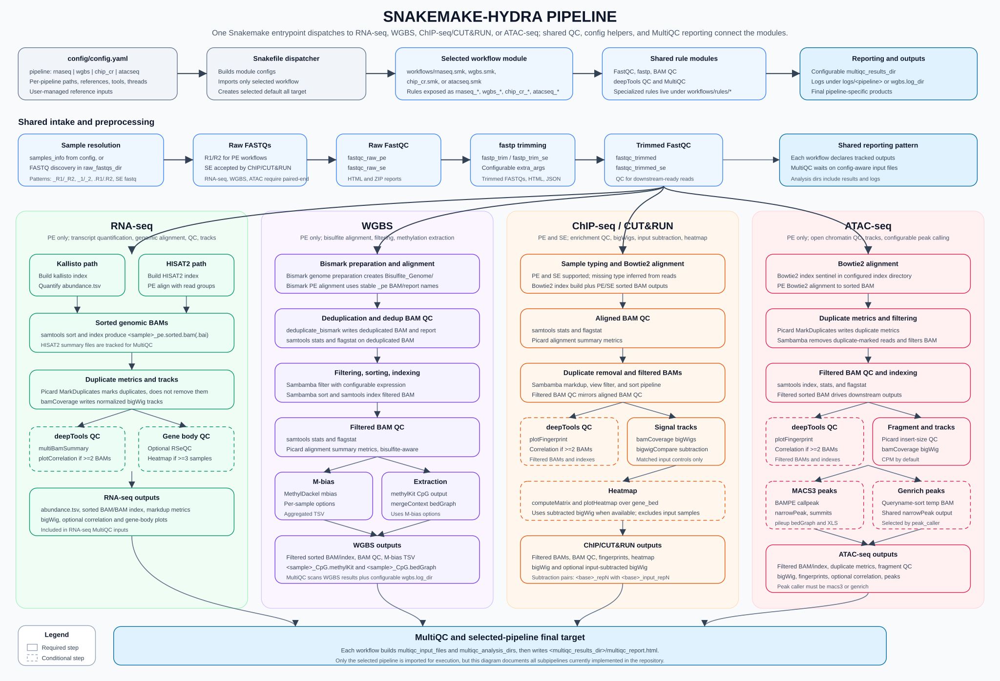

# Modular NGS Pipeline


Snakemake + Pixi pipeline for four NGS workflows: RNA-seq, WGBS, ChIP-seq/CUT&RUN, and ATAC-seq. A single value in `config/config.yaml` selects which workflow is imported and run.

## Repository Map
- `Snakefile`: top-level entrypoint; dispatches to the selected workflow.
- `config/config.yaml`: main configuration and sample/reference paths.
- `workflows/*.smk`: top-level workflow modules for `rnaseq`, `wgbs`, `chip_cr`, and `atacseq`.
- `workflows/rules/**/*.smk`: reusable and pipeline-specific Snakemake rules.
- `src/utils.py`: sample discovery and config helper functions.
- `backlog.md`: notable implemented changes and planned work.

## Requirements
- Linux.
- [Pixi](https://pixi.sh/) installed.
- Disk space for FASTQ, BAM, reference indexes, and results.
- Optional Graphviz `dot` to render DAG images.

## Setup
```bash
git clone <repo-url>
cd snakemake-hydra
pixi install
```

`pixi.toml` defines dependencies but no tasks, so run tools explicitly with `pixi run ...`.

## Configure
Edit `config/config.yaml` before running.

```yaml
pipeline: "wgbs"  # rnaseq, wgbs, chip_cr, or atacseq
```

At minimum, configure the selected pipeline block:
- `raw_fastqs_dir` and/or `samples_info`.
- Reference FASTA/BED/index paths required by that pipeline.
- Output directories if the defaults are not suitable.
- `<pipeline>.multiqc_results_dir` for the MultiQC report location.

The checked-in config contains safe placeholder paths. Replace them for your environment, but avoid changing unrelated pipeline blocks unless you intend to switch or update them.

Machine-specific paths and real sample manifests can be kept in `config/config.local.yaml`, which is ignored by Git and selected automatically when present. Set `HYDRA_CONFIG=/path/to/another.yaml` to select another complete config without recursively merging placeholder samples. Verify local files with `git check-ignore -v config/config.local.yaml` before sharing changes.

Reference inputs are user-managed. The pipeline does not download genomes or annotations. Config values are checked for presence during workflow setup; missing files, permissions, or unwritable index directories fail later during Snakemake input resolution or tool execution.

## Samples
Manual sample declarations live under the selected pipeline's `samples_info`:

```yaml
chip_cr:
  raw_fastqs_dir: "data/chip_fastqs"
  samples_info:
    liver_rep1:
      R1: "data/chip_fastqs/liver_rep1_R1.fastq.gz"
      R2: "data/chip_fastqs/liver_rep1_R2.fastq.gz"
      type: "PE"
```

If `samples_info` is missing or empty, `src/utils.py` discovers FASTQs in `raw_fastqs_dir` using these patterns:
- Paired-end: `_R1/_R2`, `_1/_2`, `.R1/.R2`.
- Single-end: `<sample>.fastq.gz` or `<sample>.fq.gz`.

Sample support differs by pipeline:
- `rnaseq` and `wgbs` require paired-end samples with `R1` and `R2`.
- `atacseq` accepts a run-aware `samples_info.<sample>.runs.<run>` mapping. Each run contains its original `R1`, `R2`, provenance fields, and read-group assignment.
- `chip_cr` accepts paired-end and single-end samples; `type` is inferred from `R2` when omitted.
- ChIP/CUT&RUN subtraction pairs signal `<base>_repN` with input `<base>_input_repN`; `<base>` may contain underscores.

## Run Commands
Dry-run the selected pipeline:

```bash
pixi run snakemake -n --cores 1
```

Run the selected pipeline:

```bash
pixi run snakemake --cores 8 --printshellcmds --latency-wait 60
```

Re-run incomplete jobs:

```bash
pixi run snakemake --cores 8 --rerun-incomplete
```

Dry-run one imported rule path:

```bash
pixi run snakemake -n --cores 1 --until <prefixed_rule_name>
```

Dry-run one concrete output:

```bash
pixi run snakemake -n --cores 1 <path/to/output>
```

Generate a DAG:

```bash
pixi run snakemake --dag --cores 1
pixi run snakemake --dag --cores 1 | dot -Tpng > dag.png
```

Focused rules must belong to the current `pipeline` value because `Snakefile` imports only the selected workflow. Imported rule names are prefixed, for example `rnaseq_hisat2_align_pe`, `wgbs_bismark_alignment`, `chip_cr_fastqc_raw_pe`, or `atacseq_bowtie2_align_pe`.

Useful concrete dry-run targets:
- RNA-seq: `results/rnaseq/kallisto/sample/abundance.tsv`.
- WGBS: `results/wgbs/methyldackel/sample_CpG.methylKit`.
- ATAC-seq: `results/atacseq/peaks/sample_peaks.narrowPeak`.
- ATAC-seq quantification: `results/atacseq/featurecounts/consensus_peak_counts.txt`.
- MultiQC: `<multiqc_results_dir>/multiqc_report.html`.

## Validation
Small real-data fixtures for RNA-seq, WGBS, ChIP-seq/CUT&RUN, and both ATAC-seq
peak callers are documented in [test_data/README.md](test_data/README.md).
The preparer retains seeded random subsets, removes temporary source FASTQs,
and generates separate configs without editing production paths.

There is no configured CI, formatter, linter, typechecker, or unit-test suite in this repository. Use Snakemake dry-runs as the main validation path:
- Snakemake parses every section of `config/config.yaml`, including inactive pipelines, so the complete YAML document must remain valid.
- Sambamba filter expressions for the selected pipeline are parsed by Sambamba during workflow construction, before any jobs run.
- Config-only changes: run `pixi run snakemake -n --cores 1` for the selected pipeline.
- Rule changes: dry-run through the affected prefixed rule with `--until`.
- Filename/path changes: dry-run a concrete output target.
- MultiQC dependency changes: dry-run the final `multiqc_report.html` path.

## Pipeline Notes

### RNA-seq
- Requires paired-end samples.
- Required config values include `transcriptome_fasta`, `kallisto_index`, `ref_genome`, and `hisat2_index_dir`.
- The pipeline can build the Kallisto index and HISAT2 indexes at the configured paths.
- Gene body coverage is controlled by `rnaseq.gene_body_coverage.enabled`; `refgene_bed` is required only when enabled.
- Gene body coverage heatmap output is tracked only when at least 3 samples are analyzed.
- The deepTools correlation heatmap is generated only when at least 2 aligned BAMs are available.

### WGBS
- Requires paired-end samples.
- `ref_genome` must point to the reference used by Bismark; Bismark creates `Bisulfite_Genome/` next to it.
- `wgbs.log_dir` overrides the default `logs/wgbs` location.
- `wgbs.sambamba.extra_args` is a Sambamba filter expression, not a generic command-line argument string.
- Bismark Bowtie2 threads are derived from `wgbs.bismark.threads / wgbs.bismark.parallel`; keep `threads >= parallel`.
- MethylDackel outputs include `<sample>_CpG.methylKit` and merged-context `<sample>_CpG.bedGraph`.

### ChIP-seq/CUT&RUN

Single-end QC and trimming select sample names explicitly from `samples_info`.
Duplicate marking writes a temporary BAM; filtering pipes into Sambamba sorting
with a shared thread budget. One-core filtering jobs run the tools sequentially.

- Supports paired-end and single-end samples.
- Requires `ref_genome`, `gene_bed`, and `bowtie2_index_dir` config values.
- Bowtie2 indexes are created in `bowtie2_index_dir` when needed.
- `chip_cr.sambamba.view_extra_args` is validated as a Sambamba filter expression before execution.
- `plotFingerprint` and correlation include input controls; heatmap `computeMatrix`/`plotHeatmap` excludes `_input` samples.
- Subtracted bigWigs are produced only for samples with matching `<base>_repN` and `<base>_input_repN` names.

### ATAC-seq

Bowtie2 adds per-run read groups, validates them, and merges runs before Picard. Alignment and filtering
share the effective job thread budget with their sorting processes. Filtering
pipes into Sambamba sort; one-core jobs use temporary files to run sequentially.

- Requires paired-end samples.
- Requires `ref_genome` and either a writable `bowtie2_index_dir` or a complete prebuilt `bowtie2_index_prefix`.
- `bowtie2_index_prefix` is the shared prefix passed to Bowtie2 `-x`, without `.1.bt2`, `.rev.1.bt2`, or another index suffix. A configured prebuilt prefix takes precedence over `bowtie2_index_dir`.
- Prebuilt indexes may use either the six `.bt2` files or the six `.bt2l` files. Partial, mixed, or simultaneously complete families are rejected before the ATAC DAG runs.
- Without a prebuilt prefix, Hydra builds and tracks all six index files in `bowtie2_index_dir`; set `bowtie2.large_index: true` to generate `.bt2l` instead of `.bt2` files.
- The index is checked once with `bowtie2-inspect`, and a prefix-specific marker is written under `reference_dir`; prebuilt index directories are never created or modified.
- `peak_caller` must be `macs3` or `genrich`.
- Both peak-caller paths expose the shared `peaks/<sample>_peaks.narrowPeak` output; Genrich uses an intermediate queryname-sorted BAM.
- Every configured R1/R2 pair is validated before trimming by normalized cluster ID, mate label, FASTQ structure, provenance, and record count. `fastq_validation.all_records: true` performs the default complete audit; setting it to `false` reports only a sampled validation of the first `fastq_validation.records` pairs.
- `samples_info.<sample>.runs.<run>.read_group` accepts `id`, `sample`, `library`, `platform`, and `platform_unit`. Use one unique `id` per run or lane, keep `sample` stable for the biological sample, and reuse `library` only for runs from the same physical library preparation.
- Each run is trimmed and aligned independently. Hydra validates every run BAM's complete RG header/tag assignment, retains run-level BAM and samtools QC files, and coordinate-merges runs by biological sample with `samtools merge`.
- Picard MarkDuplicates runs exactly once on each merged biological-sample BAM. It can therefore detect recurring PCR duplicates across runs that share an `LB`; duplicate-flagged reads are removed later with Sambamba before downstream QC, bigWig generation, and peak calling.
- Keep physical-run metadata (`provider_id`, instrument run, flowcell, lane, barcode, R1, R2, and RG values) in the manifest. Use `null` for an unavailable barcode rather than inferring it from a filename or sample label, and report the missing barcode as residual provenance uncertainty.
- The deepTools correlation heatmap is generated only when at least 2 filtered BAMs are available.
- MACS3 uses true paired-fragment `BAMPE` mode. Tn5 insertion-site shifting is intentionally left to downstream analysis.
- Per-sample narrowPeak files are converted to sorted BED3 intervals before consensus construction. `consensus_peaks.minimum_support` controls how many samples must overlap a region and defaults to `1`.
- featureCounts quantifies paired-end fragments from all filtered BAMs over the consensus peak SAF. `featurecounts.threads`, `featurecounts.minimum_mapping_quality`, and `featurecounts.extra_args` control this step.
- featureCounts uses a unique scratch directory, removed after the job, to avoid its temporary-file path overflow with long output directories.
- The default featureCounts MAPQ threshold is `0` because mapping-quality filtering is already configurable in `sambamba.view_extra_args`.
- `mitochondrial_contigs` lists contig names used to calculate the pre-filter mitochondrial fraction from aligned BAMs.
- Core ATAC QC is written both as a standalone TSV and as a custom table in MultiQC. It includes aligned/final reads, Picard duplicate metrics, mitochondrial fraction, fragments in peaks, and FRiP.
- FRiP uses the cohort-wide consensus peak set, so its value can change when samples or `consensus_peaks.minimum_support` change.
- BigWigs contain full-fragment CPM read coverage and are not Tn5-shifted insertion-site tracks.
- Bowtie2, Picard, and Sambamba behavior remains config-driven. `picard.java_opts` and `picard.markduplicates.extra_args` control duplicate marking; duplicate removal remains downstream during filtering. `sambamba.view_extra_args` is validated as a Sambamba filter expression before execution. Choose stricter ATAC-specific alignment or filtering arguments in `bowtie2.extra_args` and `sambamba.view_extra_args` when appropriate for the dataset.
- Bowtie2 alignments depend directly on all six real index files and the pipeline-owned validation marker.

## Outputs
Output paths are config-driven. Common defaults and examples include:
- MultiQC report: `<pipeline>.multiqc_results_dir/multiqc_report.html`.
- RNA-seq Kallisto: `results/rnaseq/kallisto/<sample>/abundance.tsv`.
- RNA-seq aligned BAM: `results/rnaseq/aligned_bams/<sample>_pe.sorted.bam`.
- WGBS MethylDackel: `results/wgbs/methyldackel/<sample>_CpG.methylKit`.
- ChIP/CUT&RUN bigWig: `results/chipseq_cutrun/bigwigs/<sample>_pe.bw` or `<sample>_se.bw`.
- ATAC-seq peaks: `results/atacseq/peaks/<sample>_peaks.narrowPeak`.
- ATAC-seq run BAM: `results/atacseq/aligned_bams/runs/<sample>__<run>.sorted.bam`.
- ATAC-seq merged BAM: `results/atacseq/aligned_bams/<sample>_pe.sorted.bam`.
- ATAC-seq Bowtie2 validation: `results/atacseq/reference/bowtie2_index_<hash>.validated.OK`.
- ATAC-seq consensus peaks: `results/atacseq/consensus_peaks/consensus_peaks.bed` and `.saf`.
- ATAC-seq featureCounts matrix: `results/atacseq/featurecounts/consensus_peak_counts.txt`.
- ATAC-seq QC summary: `results/atacseq/qc_summary/sample_qc_summary.tsv`.

## Troubleshooting
- No samples found: check that `samples_info` is populated or `raw_fastqs_dir` exists with supported FASTQ names.
- Rule not found in a focused run: check `config["pipeline"]`; only the selected workflow's prefixed rules are imported.
- RNA-seq/WGBS/ATAC reject a sample: these workflows require paired-end `R1` and `R2` inputs.
- Missing correlation heatmap: the workflow skips correlation when fewer than 2 BAMs are available.
- Missing RNA-seq gene body coverage heatmap: it is emitted only with at least 3 samples and when gene body coverage is enabled.
- Missing ChIP/CUT&RUN subtraction: verify names follow `<base>_repN` and `<base>_input_repN`.
- Empty ATAC consensus peaks: lower `consensus_peaks.minimum_support` or inspect the per-sample narrowPeak files.
- Invalid prebuilt ATAC index: configure the prefix without a suffix and verify that exactly one complete six-file `.bt2` or `.bt2l` family exists.
- Reference or index failure: configured references must exist and generated index directories must be writable; prebuilt indexes only need to be complete and readable.

## License
See `LICENSE`.


